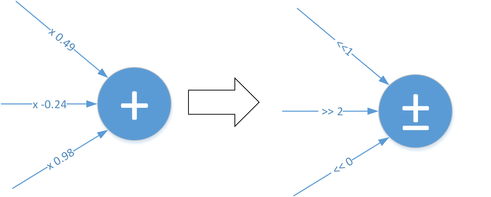
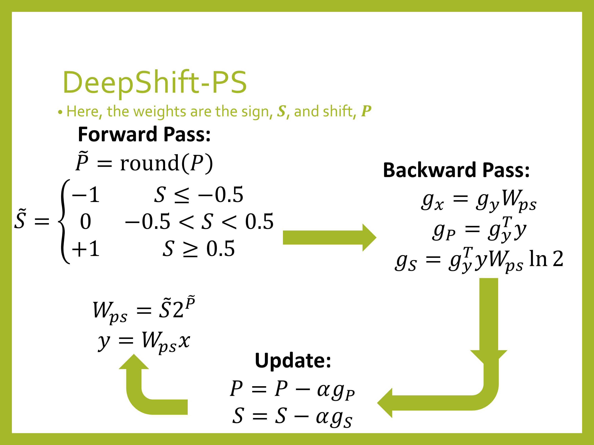

# DeepShift
This is project is the implementation of the [DeepShift: Towards Multiplication-Less Neural Networks](https://arxiv.org/abs/1905.13298) paper, that aims to replace multiplications in a neural networks with bitwise shift (and sign change).

This research project was done at Huawei Technologies.

##### Table of Contents  
- [Overview](#overview)
- [Important Notes](#important-notes) 
- [Results](#results)
- [Running the Code](#running-the-code)
- [Code Walkthrough](#code-walkthrough)
- [Running the Bitwise Shift Cuda Kernels](#running-the-bitwise-shift-cuda-kernels)
- [Binary Files of Trained Models](#binary-files-of-trained-models)


## Overview
The main idea of DeepShift is to test the ability to train and infer using bitwise shifts.


We present 2 approaches: 
- DeepShift-Q: the parameters are floating point weights just like regular networks, but the weights are rounded to powers of 2 during the forward and backward passes
- DeepShift-PS: the parameters are signs and shift values



## Important Notes
- To use the DeepShift-PS, the `--optimizer` must be set to `radam` in order to obtain good results.
- DeepShift-PS is currently much slower in training than DeepShift-Q, because it requries twice the number of parameters and twice the number of gradients. We're working on optimizing that by using lower precision type to represent their parameters and gradietns.

## Results
TBD

## Running the Code
1. Clone the repo:
```
git clone https://github.com/mostafaelhoushi/DeepShift
```

2. Change directory
```
cd DeepShift
```
3. Create virtual environment: 
```
virtualenv venv --prompt="(DeepShift) " --python=/usr/bin/python3.6
```
4. (Needs to be done every time you run code) Source the environment:
```
source venv/bin/activate
```
5. Install required packages and build the spfpm package for fixed point
```
pip install -r requirements.txt
```
6. cd into `pytorch` directroy:
```
cd pytorch
```
7. Now you can run the different scripts with different options, e.g.,
a) Train a DeepShift simple fully-connected model on the MNIST dataset, using the PS apprach:
```
python mnist.py --shift-depth 3 --shift-type PS --optimizer radam
```
b) Train a DeepShift simple convolutional model on the MNIST dataset, using the Q approach:
```
python mnist.py --type conv --shift-depth 3 --shift-type Q 
```
c) Train a DeepShift ResNet20 on the CIFAR10 dataset from scratch:
```
python cifar10.py --arch resnet20 --pretrained False --shift-depth 1000 --shift-type Q 
```
d) Train a DeepShift ResNet18 model on the Imagenet dataset using converted pretrained weights for 5 epochs with learning rate 0.001:
```
python imagenet.py <path to imagenet dataset> --arch resnet18 --pretrained True --shift-depth 1000 --epochs 5 --lr 0.001
```
e) Train a DeepShift ResNet18 model on the Imagenet dataset from scratch with an initial learning rate of 0.01:
```
python imagenet.py <path to imagenet dataset> --arch resnet18 --pretrained False --shift-depth 1000 --lr 0.01
```

## Code Walkthrough
TBD
    
## Running the Bitwise Shift CUDA Kernels
TBD

## Binary Files of Trained Models
TBD
